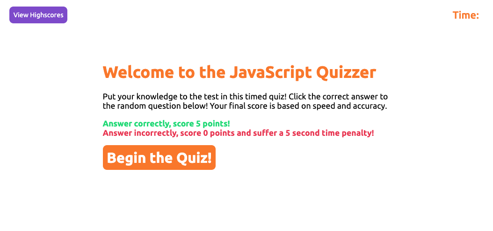
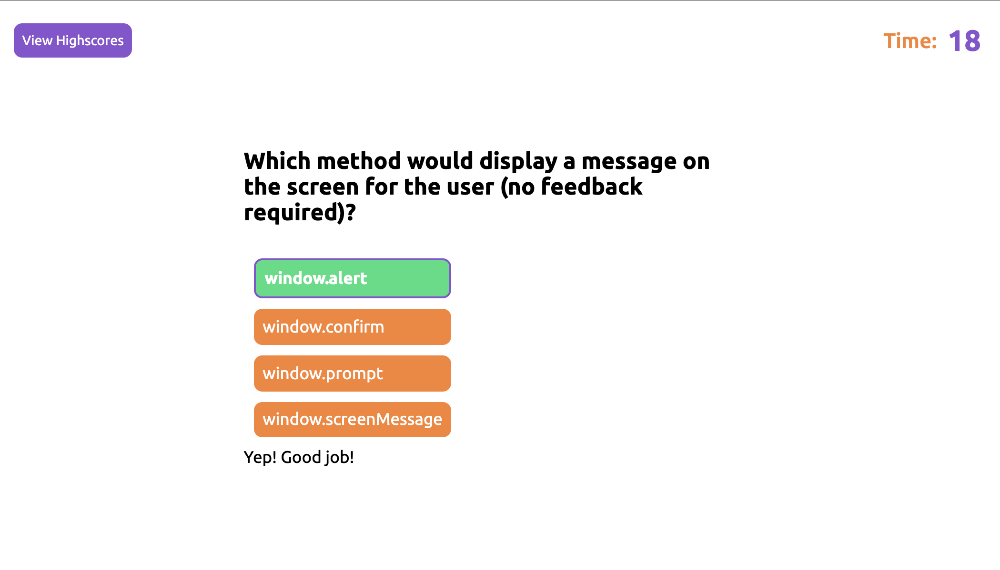
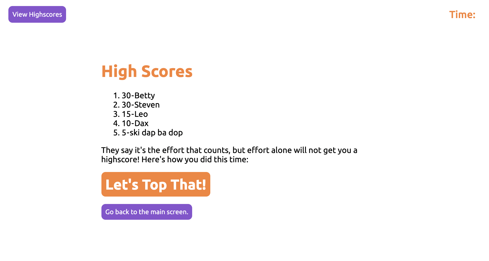

# Wilde Coding Quiz Game

## DESCRIPTION
Using HTML, CSS, and JavaScript, this site produces quiz questions to test knowledge of JavaScript principles. I used the following techniques in this project:

* HTML and CSS from scratch, with normalize.css used for some fallback styling. 
* Pseudocoding the logic for JavaScript
* Defining variables, functions, and elements for DOM manipulation and interaction.
* Utilizing localStorage for saving high scores.

This page is viewable at https://bgswilde.github.io/wilde-coding-quiz-game/

See the screenshots below for a preview:

## CREDITS
The criteria and inspiration for this quiz come from the KU Coding Bootcamp, with instruction created by Trilogy Education. © 2021 Trilogy Education Services, LLC, a 2U, Inc. brand. Confidential and Proprietary. All Rights Reserved. I utilzed various MDN documentation and online forums for some common errors and debugging.

## LICENSE
MIT License

Copyright (c) 2021 Brian Wilde

Permission is hereby granted, free of charge, to any person obtaining a copy
of this software and associated documentation files (the "Software"), to deal
in the Software without restriction, including without limitation the rights
to use, copy, modify, merge, publish, distribute, sublicense, and/or sell
copies of the Software, and to permit persons to whom the Software is
furnished to do so, subject to the following conditions:

The above copyright notice and this permission notice shall be included in all
copies or substantial portions of the Software.

THE SOFTWARE IS PROVIDED "AS IS", WITHOUT WARRANTY OF ANY KIND, EXPRESS OR
IMPLIED, INCLUDING BUT NOT LIMITED TO THE WARRANTIES OF MERCHANTABILITY,
FITNESS FOR A PARTICULAR PURPOSE AND NONINFRINGEMENT. IN NO EVENT SHALL THE
AUTHORS OR COPYRIGHT HOLDERS BE LIABLE FOR ANY CLAIM, DAMAGES OR OTHER
LIABILITY, WHETHER IN AN ACTION OF CONTRACT, TORT OR OTHERWISE, ARISING FROM,
OUT OF OR IN CONNECTION WITH THE SOFTWARE OR THE USE OR OTHER DEALINGS IN THE
SOFTWARE.

